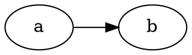

***491. Non-decreasing Subsequences*** 
If a number has been used at the level, we cannot reuse it

446


```
vector<int> partial;
vector<vector<int>> ans;
void backtrack(vector<int>& nums, int start) {
    if (partial.size() >= 2) {
        ans.push_back(partial);
    }
    bool used[201] = {false}; // the range is [-100, 100] in the problem
    for (int i = start; i < nums.size(); ++i) {
        if (!partial.empty() && nums[i] < partial.back()||used[nums[i] + 100]) continue;
        used[nums[i]+100] = true;
        partial.push_back(nums[i]);
        backtrack(nums, i + 1);
        partial.pop_back();
    }
}
vector<vector<int>> findSubsequences(vector<int>& nums) {
    backtrack(nums, 0);
    return ans;
}
```

<script src="https://unpkg.com/d3@5.16.0/dist/d3.min.js"></script>
<script src="https://unpkg.com/@hpcc-js/wasm@0.3.11/dist/index.min.js"></script>
<script src="https://unpkg.com/d3-graphviz@3.1.0/build/d3-graphviz.min.js"></script>
<script>
  function d3ize(elem) {
    var par = elem.parentElement;
    d3.select(par).append('div').graphviz().renderDot(elem.innerText);
    d3.select(elem).style('display', 'none');
  }
  console.log(document.getElementsByClassName(".language-dot"));
  var dotelems = document.getElementsByClassName("language-dot");
  for (let elem of dotelems) {
    d3ize(elem);
  }
</script>